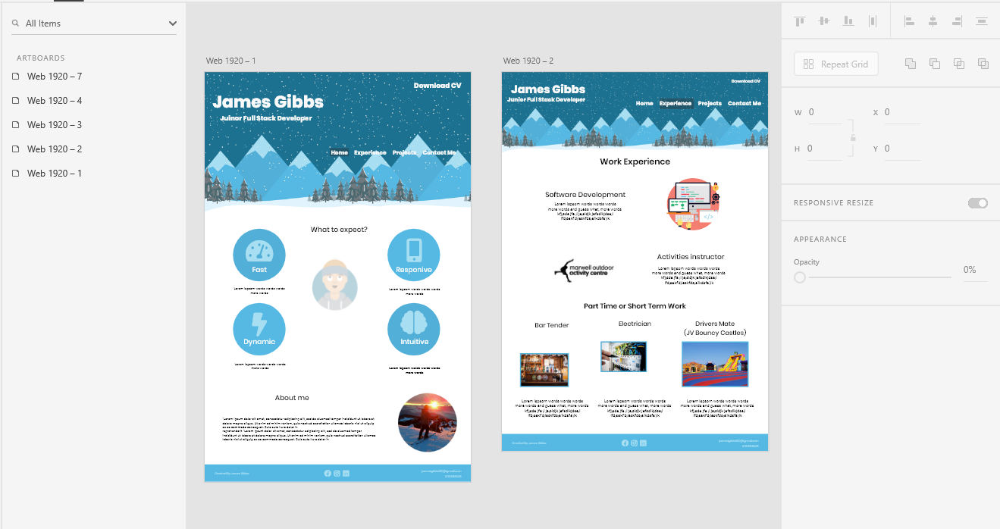

# Milestone 1

This is my first project for the Code Institute Full Stack Development diploma. I have developed a resume for future employers to be able to look at my experience gained through past projects and work experience. This gives future employers the opportunity to make contact with me and begin the work process if appropriate.

## UX

This project is designed to be used by potential employers, potential clients and software developers to be able to approach me and find out more information.

### User Stories

- Anyone who is interested in my professional experience and would like to look at my previous work.
- An employer who is looking for a software developer to join their team.
- A client who would like to see my previous projects. 
- A software developer who would be interested in working in collaboration with me.
- Friends or family who are interested in what I am doing.

### Mockups

The web site consists of five pages with each page having a different function.

### Wireframing

I drew my first plan on paper which contained the basic structure and layout of the site, following this I then used Adobe XD to create the final design. The next stage was to choose colours and font  as I could see how the different features looked together.

[PDF of Adobe XD design](assets/pdf/milestone1.pdf)

[Adobe XD File](assets/pdf/milestone1.xd)

## Features

In this section, you should go over the different parts of your project and give any additional information.

### Existing Features

- **Navagtion Bar** – Allows intuitive navigation around the different pages of my web site.
- **Drop down** – Allows access to subpages of the web site easily.
- **Footer** – This contains links to my social media accounts as well as email so people can get quick access to my contents on each page.
- **Contact form** – A page that makes the process of contacting me accessible from the webpage.
- **Projects page** – A page that contains all of my previous projects organised in an easy to read view.
- **Responsive** – This ensures that the website works on all screen sizes.
- **GitHub Repository** links – Gives easy access to previous projects.
- **Downloadable CV** – A PDF CV  to provide a company with a clear paper copy of my CV if required.

### Design Colours

I decided to base my colours on the hero image so the whole site would have a cartoon effect winter to make my website attractive and inviting.

**Colour Scheme**

- `#FFFFFF` - White
- `#FAFAFA` - Off White
- `#55B9E3` - Base Blue
- `#A7DEF2` - Lighter Blue
- `#1C7191` - Darker Blue

### Fonts

I acquired the font from Google fonts. I used Poppins for the headings and titles as I believe this was appropriate to the main theme of the website. Roboto compliments Poppins so I have used this for the contents. 

`@import url("https://fonts.googleapis.com/css2?family=Poppins:wght@400;700;800&family=Roboto&display=swap");`

### Images

All the images I have used are from Google images, I have ensured that they are all permissible to use. I also used https://getavataaars.com/ to create the avatar and then used Photoshop to edit this for the hero image.

### Features Left to Implement

- Make form functional.
- Add animations to the hero image to make the snow fall.
- Make the site more interactive

## Technologies Used

- [HTML5](https://en.wikipedia.org/wiki/HTML5) – Used to create the structure and content of the site
- [CSS3](https://en.wikipedia.org/wiki/Cascading_Style_Sheets#CSS_3) – Used to add styling and animations
- [Bootstrap](https://getbootstrap.com/) – Used to add layout and responsiveness to elements
- [Font Awesome](https://fontawesome.com/) – Used to add icons and link to social media
- [Google Fonts](https://fonts.google.com/) – Supplies the fonts for the websites
- [jQuery](https://en.wikipedia.org/wiki/JQueryhttps://en.wikipedia.org/wiki/JQuery) – Used for DOM manipulation
- [GitPod](https://gitpod.io/) – The IDE used for the project
- [Git](https://en.wikipedia.org/wiki/Git) – Used for the version Control
- [GitHub](https://github.com/) – Used to host the repository and the website itself
- [Adobe XD](https://en.wikipedia.org/wiki/Adobe_XD) – Used to create the UX of the website
- [Adobe Photoshop](https://en.wikipedia.org/wiki/Adobe_Photoshop) – Used to edit any images

## Testing

### Testing Tools

I have used the following tools to test my website from different perspectives.

- W3C [HTML](https://validator.w3.org/) and [CSS](https://jigsaw.w3.org/css-validator/) validators – to test for any Errors in the code
- [Firefox Developer Tool](https://developer.mozilla.org/en-US/docs/Tools) – to test layout, styling and responsiveness throughout the whole site and also used to test different screen sizes.

### Physical Testing
- [Motorola Moto G](https://en.wikipedia.org/wiki/Moto_G_(1st_generation))
- [iPhone SE](https://en.wikipedia.org/wiki/IPhone_SE_(1st_generation))
- **Desktop computer with 1080p 24inch monitor**
- **1366 x 768 monitor 19inch**

### Simulated Testing with Firefox dev tools

- Samsung Galaxy S9
- iPhone 6/7/8
- iPhone X
- iPad
- Kindle Fire HDX

### User Testing

I also asked my Parents and brother to test the web site using my desktop pc and my motorala moto g.

### Browsers Used For Testing

- Google chrome
- Mozila Firefox
- Opera

**Mobile**

- Google chrome
- Safari

### User Stories

**Employer**

1. Goes to experience page
2. Scrolls to full time work
3. Views experience
4. Scroll to part time work
5. Views experience
6. Scrolls to top
7. Clicks on Download CV
8. CV opens in new window
9. Do this is both desktop and mobile

**Client**

1. Goes to project page
2. Views previous project
3. Clicks on GitHub link
4. GitHub Repository opens in new page
5. Goes to contact form
6. Tries to send form without data
7. Form tells the user to enter data
8. User enters data and clicks submit
9. Do this both in desktop and mobile

### Testing Results

During testing I found that the links to the git hub repositories closed the web page. I found this could be confusing and have therefore  corrected  this using `target= “_blank”`. This made it so the links opened a new window.
I also found that when I deployed the website the screen shots were not showing up. I fixed this by removing the `../` from the file path.

## Deployment

To deploy my site I chose to used GitHub Pages For the Repository (link).
To do this I took the following steps:

    1. I selected settings and scrolled down to the GitHub Pages section.
    2. Under the drop-down that labelled None and changed to to Master Branch in the Source section.
    3. The paged then refreshed and in the GitHub Pages section there is a link to the website.

Link [https://jamesigibbs.github.io/milestone1/](https://jamesigibbs.github.io/milestone1/)

To clone the project and edit it locally on your computer you must follow the following steps:

    1. In the GitHub Repository you must click “Clone or Download”.
    2. Copy the URL which pops up underneath.
    3. Open you IDE of choice.
    4. Open Git Bash.
    5. Type `git clone and paste the URL` and hit Enter.

Clone link [https://github.com/jamesigibbs/milestone1.git](https://github.com/jamesigibbs/milestone1.git)

## Credits

### Content

- Navbar was taken from bootstrap documentation and then modified.
- Fonts are from a website [Google fonts](https://fonts.google.com/).
- [Font Awesome](https://fontawesome.com/) provided all of the icons on the website.

### Media

- The hero image I edited an image from [Nice PNG](https://www.nicepng.com/).
- The avatar image was from [getavataars](https://getavataaars.com/)  and then edited.
- All other images were obtained from google images and I checked the websites that hosted the images to checked it was permissible to use them.

### Acknowledgements

- I got inspiration for my project from [http://findmatthew.com/](http://findmatthew.com/)
- I received help from **Caleb Mbakwe** who is my mentor
- **Richard Wells** and **Simen Daehlin** both helped me a with queries on my code
- I would also like to thank all the **Code Institute tutors** for helping me with this project